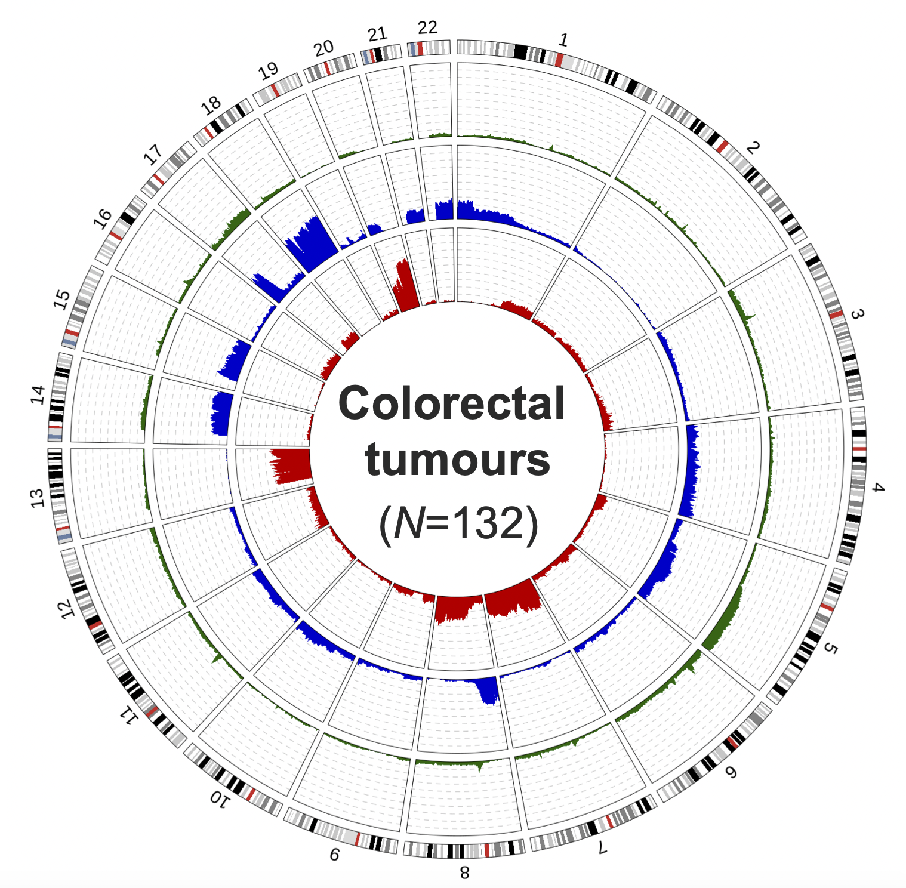

#####################################################################

# Title: Visualization_CNAs

Author: Sara Lahoz

Link: https://github.com/sr-lhz/Visualization_CNAs.git

Directory/Path: /sr-lhz/Visualization_CNAs

Description: Script(s) in R for visualizing sample-specific profiles of copy-number alterations (CNAs) -including chromosomal gains, losses, and events of loss-of-heterozygosity (LOH)-, based on the log2-ratios & B-Allele Frequency (BAF) parameters as obtained from SNP-array or next-generation sequencing (NGS) data.

#####################################################################

